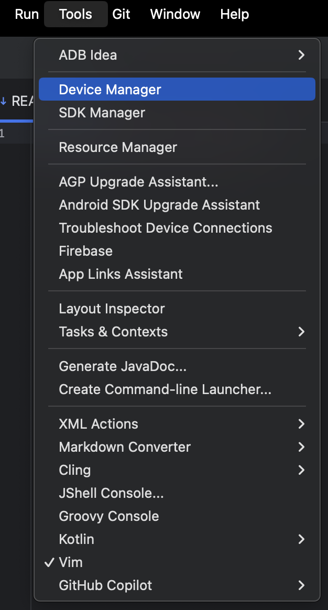
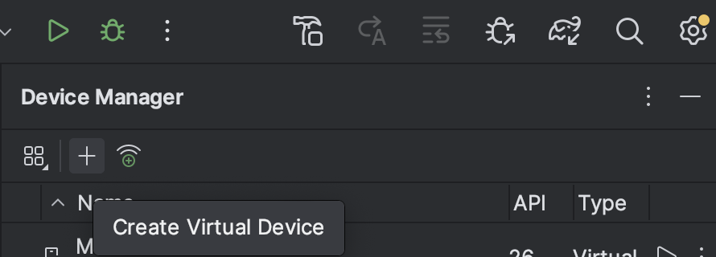
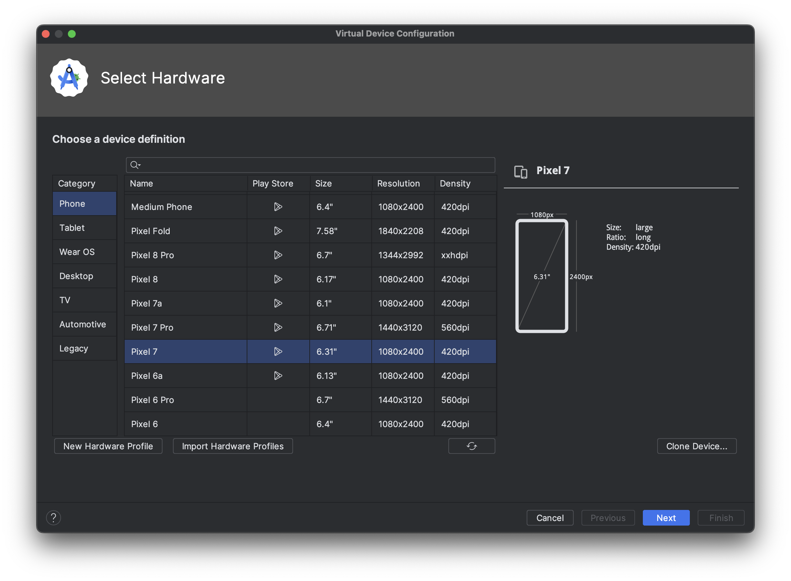
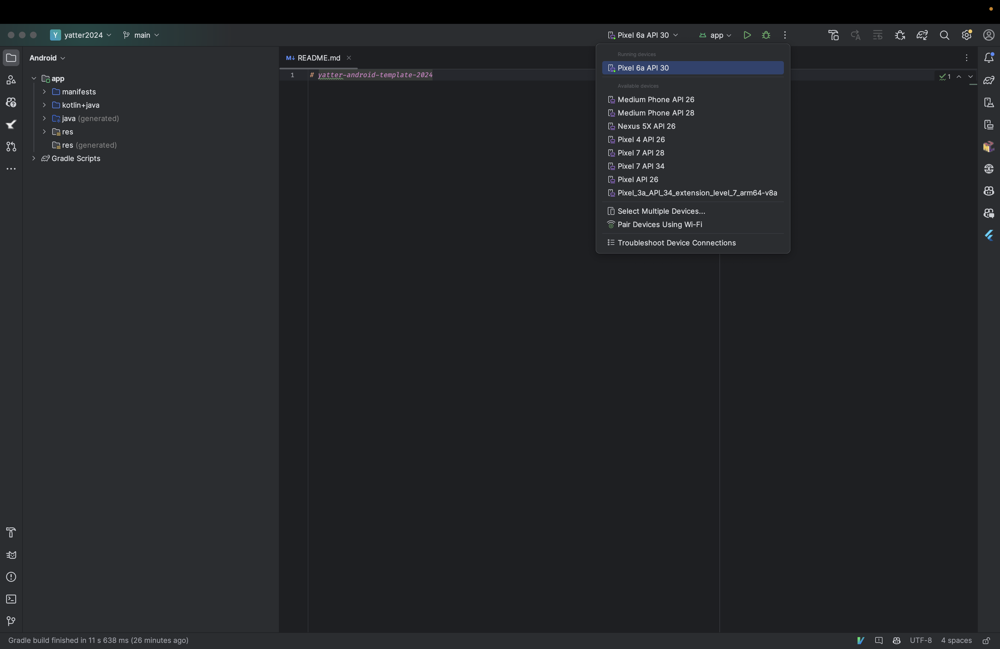
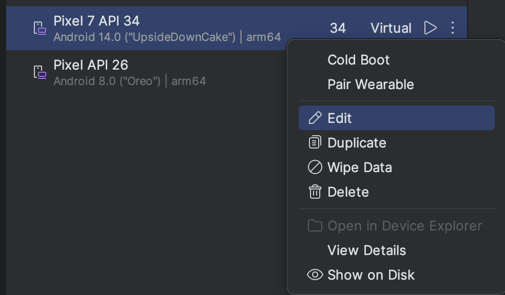

# [前の資料](./2_ブランチ運用.md)
# エミュレータの作成
本章では、エミュレータを作成するのに必要なセットアップを行います。  
エミュレータとはAndroid Studio上で実行される仮想デバイスのことです。  
今回のサンプルでは`Pixel 7のAndroid 14`のエミュレータを作成していきます。

## DeviceManagerの起動
Android Studioにはエミュレータを作成するDeviceManagerという機能があります。  
DeviceManagerでは様々な画面サイズやOSバージョンのエミュレータを作成できます。

Device ManagerはAndroid Studioの画面右上に存在します。

画面上部にある`Tools`から`Device Manager`をクリックすると今までに作成したエミュレータ一覧が表示されます。  
`Create device`のボタンを押すことで新しいエミュレータを作成することができます。  

新しいエミュレータ作成では`TV`や`Tablet`なども選べますが、今回は`Phone`で作成します。  
その際に作成するエミュレータ端末は選ぶことができます。

作成する端末を選んで`next`を押した後はエミュレータに搭載するAndroid OSのバージョンを決めます。  
恐らく初期段階ではダウンロードするOSが多いと思うので、`UpsideDownCake`だけ`Download`します。

ダウンロードは完了するまで時間が掛かります。

ダウンロードが確認できたところで、ダウンロードしたOSを選択して`next`を押します。  
Verify Configurationではストレージ容量やメモリ容量を設定できます。  
今回はそのままの設定でエミュレータを作成するので`finish`を押します。  

作成が完了するとアプリを実行するエミュレータを選べるようになります。

他にもエミュレータを作成した場合は画面上部のエミュレータ名が表示されているところをタップすると  
起動したいエミュレータ一覧が表示されます。

今回の手順ではエミュレータの詳細設定は変更しませんでしたが、今後必要になれば変更も可能です。  
その場合は`Device Manager`の鉛筆アイコンを押すことで設定画面が開きます。

# [次の章へ](../1.はじめに/1_全体概要.md)
