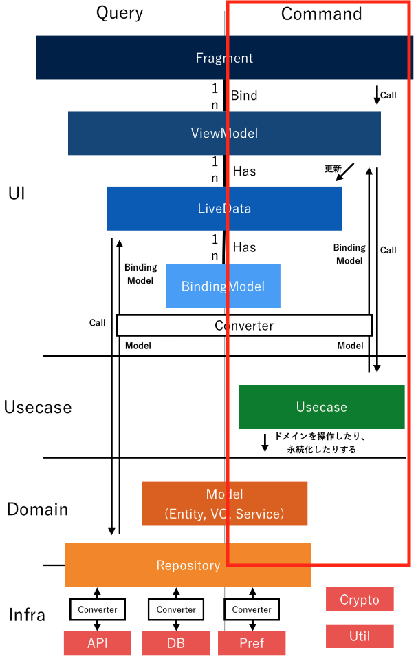

# [前の章へ](../2.パブリックタイムライン/2_UI層実装.md)
# ログイン画面の実装
ログイン画面は作成済みのアカウントでアプリにログインするための画面です。  

ログイン画面でもデザインの指定はないためシンプルな画面を目指して実装します。もちろん、デザインにこだわった実装をしても問題ありません。

ログイン画面では先ほど作成したパブリックタイムライン画面への遷移も実装します。

## 完成イメージ

## 全体像
ログイン画面では次のようなクラス図で実装します。

※今回の研修では、「ui」と書かれた部分を実装していきます。

パブリックタイムライン画面ではQueryを実装しましたが、ログイン画面ではCommandを実装します。  
つまり設計方針の右側部分を実装します。

## 実装の流れ
1. UIに表示する情報、UIの状態、イベント(パスワード入力など)を管理するクラスを作成しておく
    - BindingModel、UiState、ViewModel
1. UIを実装
    - Jetpack Compose
1. パブリックタイムライン画面への動線を実装
    - Navigation Compose

# [次の資料](./2_UI層実装.md)
